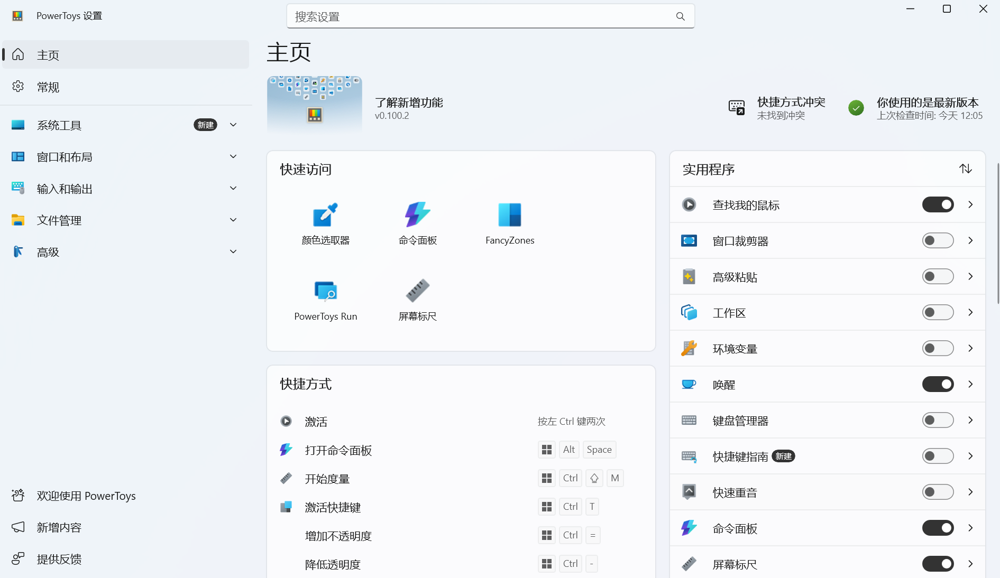
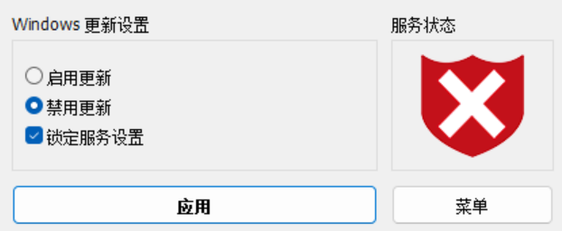

我身边很多同学的电脑经常会卡顿，各种各样的小毛病。我的25款r9000p舍友就经常问我，为什么我打不开xxx，为什么我的电脑不如你的流畅，或者说怎么截屏，各种各样的快捷键是什么各种各样的\
所以说这篇博客主要就是分享一下我在用的一些实用的小工具的说
 
整理的工具都是咱自己的用的喵，所以说安全性方面是没的说的，再有就是毕竟是咱喵自己整理，可能覆盖比较少，或者说工具数量比较少什么的，希望不要介意\
主要涵盖系统优化、效率办公、文件管理、装机运维、桌面美化五大场景。

 
### Microsoft PowerToys

我觉得 PowerToys 最大的优点也是**方便**。很多功能平时看起来不起眼，但真正需要的时候会发现特别省时间。其本身也是微软官方给windows系统的增强插件

我比较喜欢的几个功能：

- **PowerToys Run**：按快捷键就能快速搜索程序、文件，还可以进行一些简单的计算。
- **FancyZones**：可以自定义窗口布局，把多个软件按照自己的习惯快速排列。
- **PowerRename**：批量修改文件名的时候特别方便，不需要一个个手动修改。
- **Image Resizer**：可以批量调整图片尺寸，平时写博客处理图片的时候很实用。
- **Color Picker**：看到网页上喜欢的颜色，可以直接吸取颜色值。
- **Always on Top**：可以让某个窗口始终保持在最上层，查资料或者对照代码的时候很方便。

我比较喜欢 PowerToys 的地方是，它里面很多功能都属于平时想不到，但用了以后就回不去了的类型。\
这里我着重说一下\
**查找鼠标光标**

**双击 `Ctrl`** 就可以快速查找鼠标光标。

这个功能其实不用多说，平时使用电脑的时候经常会遇到找不到鼠标光标的情况，鼠标在屏幕上晃来晃去半天还是找不到。\
这个时候只需要**双击 `Ctrl`**，屏幕就会变暗，并自动将视线聚焦到鼠标光标所在的位置，找鼠标的时候非常方便。\
尤其是 Windows 用户，如果平时经常处理文件、图片、窗口，或者想提高一点操作效率，我觉得装一个 PowerToys 还是挺值的。

> 很多功能不一定天天用，但需要的时候能直接省掉不少麻烦。

  
 
### 图吧工具箱

图吧工具箱应该算是我比较常用的电脑工具之一了。它把很多硬件检测、性能测试、烤机和跑分之类的工具整合到了一起，平时折腾电脑的时候会方便很多。\
我比较常用的几个工具主要有下面这些。

- **AIDA64**

AIDA64 主要用来查看电脑的详细硬件信息，也可以进行一些性能测试。\
像 CPU、主板、内存、显卡、硬盘这些硬件的信息都可以在里面看到，而且信息非常详细。尤其是想确认电脑硬件型号、查看内存参数或者了解系统具体配置的时候，AIDA64 会比较方便。\
除此之外，AIDA64 还有稳定性测试功能，可以让 CPU、内存等硬件进行负载测试，用来简单检查电脑在高负载下是否稳定。

- **CPU-Z**

CPU-Z 主要用来查看 CPU、主板和内存等硬件信息。\
相比 AIDA64，CPU-Z 的界面更加简单，打开之后就可以直接看到 CPU 型号、核心数、频率、内存规格等信息。\
平时我如果只是想快速确认一下 CPU 或者内存的具体参数，一般直接打开 CPU-Z 就够了。

- **Geek Uninstaller**

Geek Uninstaller 是一个比较轻量的卸载工具，
它和 Windows 自带的卸载功能相比，我觉得比较方便的一点是，卸载软件之后还可以继续扫描残留文件和注册表项，尽量把没有清理干净的东西一起处理掉。
平时有些软件正常卸载之后，可能还会留下一些文件或者文件夹，这时候用 Geek Uninstaller 再清理一下会方便很多。
它的界面也比较简单，打开之后就能看到电脑里安装的软件，找到想卸载的程序后直接操作就可以。
对我来说，它比较适合用来处理一些**不太好卸载或者卸载后残留比较多的软件**。

- **DiskInfo**

DiskInfo 主要用来查看硬盘的健康状态。\
像硬盘的型号、温度、通电时间、通电次数以及**0E报错**信息都可以看到。\
如果是买二手电脑或者二手硬盘，我觉得这个工具尤其有用，可以比较直观地看看硬盘目前的状态。

图吧工具箱里面还有很多其他工具，不过这些基本就是我比较常接触的几个。\
我喜欢图吧工具箱的原因还是省事。以前需要分别下载一堆软件，现在直接打开图吧工具箱就能找到，尤其是在装机、测试电脑或者排查硬件问题的时候会方便很多。

### Windows Update Blocker 

软件的功能非常简单，就是单纯的通过一次点击彻底禁用或启用 Windows 自动更新。

### 7-Zip

7-Zip 是一个免费、开源的文件压缩和解压工具，也是我比较推荐装在 Windows 上的软件之一。

它最大的优点就是**轻量、免费，而且功能够用**。平时遇到 `.zip`、`.7z`、`.rar` 等压缩包以及比较少见的压缩包都可以直接用它打开和解压，不需要为了不同格式安装好几个软件。\
7-Zip 自己的 `.7z` 格式压缩率也比较高，如果比较在意压缩包的体积，可以使用 7z 格式来压缩文件。\
另外，它还可以直接在文件右键菜单里使用，压缩和解压都比较方便。

对我来说，比win11自带的好用，而且功能多（虽然但是，咱自己用的是bandzip，功能其实都一样，主要是有操作页面，看着舒服点，但是有付费和更新弹窗）

> 简单、免费、好用，占用小，基本没有什么理由不在电脑里备一个。

<!--Everything，"D:\xwechat_files\wxid_kwp7g8muimsk22_d601\msg\file\2026-08\系统优化(1).exe"，obs，卡巴斯基-->
### Everything

Everything 是一款非常轻量的文件搜索工具，搜索速度很快。\
平时电脑文件比较多的时候，可以直接输入文件名快速找到需要的文件，也支持通过文件类型进行筛选。\
比如：

`*.png`

可以搜索所有 PNG 图片。

整体来说就是一款**简单、快速、实用的文件搜索工具**反正比Windows自带的搜索好用的说。

### Windows 11 轻松设置

Windows 11 轻松设置是一款专门针对 **Windows 11** 打造的系统管理与优化工具，功能比较丰富，适合不太想自己一个个翻 Windows 设置的用户。

软件主要分为**系统设置、高级设置、Defender、Apps、常用软件和系统信息**几个部分，可以集中处理不少平时比较常用的系统功能。

在「系统设置」和「高级设置」中，可以直接调整一些 Windows 功能，例如**系统还原、搜索热点、小组件、自动更新硬件驱动、微软客户体验改善计划、Windows 更新、程序兼容性助手、诊断策略服务**等，也可以进一步设置 **UAC、DEP、WDAC、Spectre/Meltdown 防护**等高级选项。\
「Defender」页面则可以查看 Windows Defender 当前的运行状态，并提供**一键禁用 WD**和**一键恢复 WD**的功能。对于需要临时调整 Defender 设置的人来说，不需要自己去找一堆系统服务和安全选项。\
「Apps」主要用于管理 Windows 自带应用，可以查看和卸载部分系统应用，例如**照片、计算器、时钟、录音机、记事本、画图、天气、终端、媒体播放器**等，同时还提供一些应用扩展的管理功能。\
「常用软件」则比较实用，里面整合了一些常见软件，可以直接进行**一键安装和卸载**。例如 **WinRAR、Notepad3、XnViewMP、PotPlayer、7-Zip、Everything** 等，对于刚装好 Windows 的电脑，可以省去一个个寻找和下载安装包的步骤。\
另外，「系统信息」还能查看当前 Windows 版本以及电脑的**CPU、内存、显卡和驱动版本**等硬件信息，简单了解一下自己的电脑配置还是很方便的。

整体来说，这款软件更像是一个**Windows 11 综合管理工具箱**，把很多分散在系统设置里的功能集中到了一起。对于喜欢折腾 Windows、重装系统，或者想快速调整电脑设置的人来说，会比较方便。

> 把常用的 Windows 设置集中到一个软件里，需要改什么的时候直接找，不用到处翻系统设置。

### 卡巴斯基(病毒吧吧主喜羊羊炒鸡推荐)

卡巴斯基（Kaspersky）是一款比较知名的安全防护软件，主要用于**病毒查杀、实时防护和网络安全保护**。\
它可以在后台实时监控电脑中的文件、程序和系统活动，发现病毒、木马、间谍软件等威胁时及时提醒用户，并进行拦截或处理。

除了最基本的病毒扫描之外，卡巴斯基还提供了比较完善的安全防护功能，比如**实时保护、网页防护、恶意软件拦截、勒索软件防护、危险网站拦截**等，可以在日常使用电脑的时候提供比较全面的保护。\
它的扫描功能也比较丰富，可以根据自己的需求选择不同的扫描方式。比如只检查某个文件夹或磁盘，也可以进行更加全面的系统扫描。对于经常下载软件、安装各种程序，或者会接触来源不明文件的用户来说，这些功能还是比较实用的。\
另外，卡巴斯基的安全检测也不只是针对传统病毒。现在很多恶意程序会伪装成正常软件，或者通过网页、邮件和下载文件进入电脑，因此一款安全软件除了能够查病毒之外，也需要及时发现这些可疑行为。

不过，卡巴斯基的功能比较多，开启较多安全功能之后，对电脑资源也会有一定占用，而且部分高级功能需要付费版本才能使用。

整体来说，卡巴斯基属于**功能比较全面、安全防护能力比较强**的杀毒软件。如果平时经常下载文件、安装软件，或者比较在意电脑的安全性，可以考虑使用。

> 杀毒软件最重要的作用不是等电脑中毒以后再处理，而是在威胁出现之前及时发现并拦截。